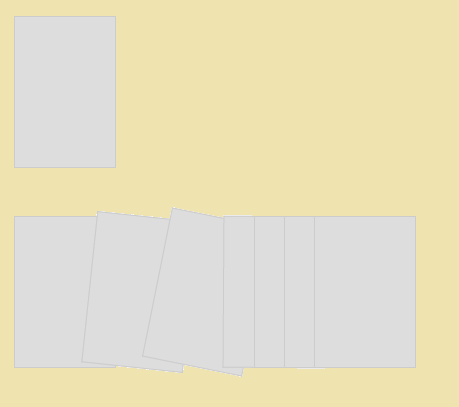

tween
=====

A small demo of using the GSAP TweenLite library with a staggering card like animation show and hide

The final demo would appear something lke shown above. The included TweenLite libray resides in assets. Just download the code to local machine and open index.html and you are good to go.